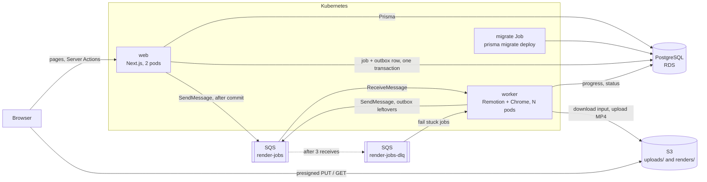
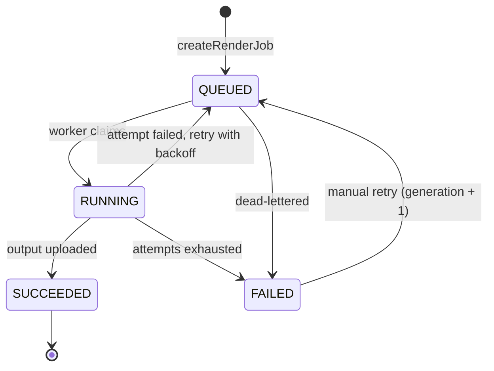

# Architecture

## Overview



Locally, MinIO stands in for S3 and ElasticMQ for SQS. The code uses the AWS
SDK in both cases and only the endpoint settings differ.

## What each piece does

| Piece | Role here |
| --- | --- |
| **Next.js App Router** | The web app. Pages are Server Components that query Postgres directly; there is no separate REST API for the UI. |
| **Server Components** | Render on the server with data already loaded. The reels grid, the export screen and the exports list are plain `async` functions calling Prisma. The editor page loads the reel and its media library this way, then hands them to the client editor. |
| **Server Actions** | Every mutation: create a reel, save the timeline (with a revision check), save the caption, issue an upload URL, confirm an upload, export, retry. Each one validates input with zod and checks the workspace. |
| **Remotion** | React for video. One composition (`packages/render/src/reel`) draws a reel; `@remotion/player` shows it live in the editor and the worker renders the same component to MP4 ([ADR 0006](adr/0006-one-composition-for-preview-and-export.md)). |
| **Route Handlers** | Used only where the caller is not this app's UI: `/api/health`, `/api/ready` for Kubernetes probes, `/api/editor/render` for the timeline editor. |
| **Prisma** | Schema, migrations and a typed client, shared by web and worker through `packages/db`. |
| **PostgreSQL** | Source of truth for properties, media, jobs and outputs. Job status changes are conditional updates. |
| **S3** | Stores uploads and rendered MP4s. The browser uploads straight to it with a presigned URL, so large files never pass through Next.js. |
| **SQS** | Hands render jobs to workers. Gives at-least-once delivery, a visibility timeout that acts as a lease, and a dead-letter queue. |
| **Worker** | Long-polls SQS, renders with Remotion (headless Chrome + ffmpeg), uploads the MP4, updates the job. One render per pod at a time. |
| **Turborepo** | Runs `typecheck`, `test` and `build` across the workspace in dependency order with caching, and makes sure the Prisma client is generated first. |
| **Docker** | One image per deployable: `web` (Next.js standalone output) and `worker` (Node, ffmpeg, Chrome). |
| **Kubernetes** | Runs web and worker as separate Deployments with probes, resource limits and rolling updates; runs migrations as a Job. |
| **Helm** | Packages the Kubernetes manifests. `values.yaml` targets AWS, `values-kind.yaml` the local cluster. |
| **kind** | A Kubernetes cluster inside Docker, for running the chart locally. |
| **GitHub Actions** | Lint, typecheck, unit tests, Helm lint, image builds, Trivy scans, end-to-end tests. On `main`, pushes the scanned images to GHCR and commits the new tag for Argo CD. Also pushes to ECR once an AWS role is configured. |
| **Trivy** | Scans the lockfile, the Dockerfiles and manifests, and the built images for known vulnerabilities and misconfiguration. |
| **Argo CD** | GitOps deploy: the cluster pulls the chart and the image tag from Git and keeps itself in sync, so a merge to `main` is a deploy and a revert is a rollback (`infra/argocd`). |
| **Vitest** | Unit tests for the state machine, queue decisions, upload rules and the worker's message handler, plus outbox tests against a real Postgres. |
| **Playwright** | End-to-end tests through a real browser against the running stack, including a real render. |

## Repository layout

```
apps/web          Next.js app: mobile reels editor (Server Components, Server Actions)
apps/worker       SQS consumer that renders jobs
apps/editor       Standalone browser timeline editor (Vite)
packages/core     Pure logic: timeline edits, Instagram rules, job state machine, retry decisions, upload rules
packages/db       Prisma schema, migrations, client, seed
packages/render   Remotion compositions (the Reel composition) and render functions
e2e               Playwright tests
infra/helm        Helm chart for web, worker and the migration Job
infra/kind        Local cluster config and bootstrap script
infra/k8s/local   Postgres, MinIO and ElasticMQ for the local cluster
infra/argocd      Argo CD install script and Application
infra/terraform   Early AWS resource sketch (S3, CloudFront, SQS, RDS)
docs/adr          Architecture decision records
```

## Database schema

| Model | Purpose |
| --- | --- |
| `Workspace` | Tenant boundary. Every query is scoped to the current user's workspace. |
| `User` | Belongs to one workspace. There is no login yet: requests act as a seeded demo user, resolved in one function (`apps/web/lib/workspace.ts`). |
| `Reel` | One reel being edited. `timeline` is the edit as JSON (validated by `timelineSchema`), `revision` guards autosave against a second tab, `caption` is the Instagram post text. |
| `MediaAsset` | The workspace's media library: photos, videos and songs. `objectKey` is the S3 key; `thumbKey` a JPEG made in the browser; `durationMs`, `width`, `height` measured in the browser before upload. |
| `Tour` | A walkthrough of one home: its floor plan (`plan`, validated by `planSchema`). Media that belongs to it stores `tourId`, the `room` name and a `spot` (position and camera direction on the plan). |
| `Property`, `Template` | From the first, per-listing flow. Kept in the schema; the mobile editor does not use them. |
| `RenderJob` | One request to render. Holds `status`, `progress`, `attempt`, `generation`, `heartbeatAt` and the last `error`. For a reel export (`kind = REEL`), `payload` is a frozen copy of the timeline and the storage keys of its media. |
| `OutboxMessage` | A queue message that still has to be sent. Written in the same transaction as the job it announces, deleted once SQS has it ([ADR 0010](adr/0010-transactional-outbox-for-render-messages.md)). |
| `RenderOutput` | The finished MP4. `jobId` is unique: one output per job, however many times it was rendered. |

## Render job lifecycle



A job becomes `QUEUED` in the same transaction that writes its queue message
to the `OutboxMessage` table. The web app sends the message right after the
commit; if that fails, or the process dies first, a relay loop in every worker
sends it later. A `QUEUED` job therefore always has a message on its way.

The transition table is `packages/core/src/job-status.ts`. What a worker does
with each delivery is `decideDelivery` in `packages/core/src/queue.ts`:

| Job row when the message arrives | Action |
| --- | --- |
| missing, `SUCCEEDED`, `FAILED`, or a different `generation` | delete the message (duplicate or stale) |
| `QUEUED` | claim and render |
| `RUNNING`, heartbeat fresh | leave the message; another worker has it |
| `RUNNING`, heartbeat older than 60 s | claim and render; the previous worker died |

Timing, all configurable: visibility timeout 120 s, heartbeat every 20 s,
stale after 60 s, 3 attempts, backoff 15 s then 30 s.

## The editor

```
┌─────────────────────────┐
│ ✕   Reel 4      [Export]│  title (autosaves), save state
│     ┌───────────┐       │
│     │  9:16      │       │  Remotion Player: the Reel composition
│     │  preview   │       │  tap to play; drag selected text;
│     └───────────┘       │  Instagram safe-zone guides
│ ▶ 0:04.2 / 0:12.0  ↶ ↷  │  timecode, undo, redo
│ 0s  |1s   2s   3s       │  scale rule
│ [photo][video  ][photo]+│  clips; the strip scrolls under the
│      [Just listed]      │  fixed red playhead (scrubbing)
│ [♫ song.mp3          ]  │  text and music lanes
│ Split Trim Speed Look … │  tools for the selection
└─────────────────────────┘
```

- **State.** The timeline lives in a reducer with undo/redo snapshots.
  Every edit is a pure function from `packages/core`; sliders merge into one
  undo step.
- **Playhead.** The current time is kept outside React state and pushed to
  the timecode and the timeline scroll position, so playback at 30 fps does
  not re-render the editor.
- **Saving.** 700 ms after an edit, `saveReel` sends the whole timeline with
  the revision it last saw. If another tab saved in between, the save is
  refused and the editor asks for a reload instead of overwriting.
- **Floor plan.** Media from a home tour knows where it was shot. Adding it
  to a reel copies that position onto the clip and embeds the tour's plan in
  the timeline, so the export needs nothing else. The overlay
  (`PlanOverlayView`) lights up the current room, moves the marker between
  shots and turns its view cone with the 360 camera. Room names can be added
  as labels in one tap.
- **Walking between 360 photos.** A photo from a tour knows the room around
  it (outline, camera height, ceiling height). The 360 shader projects the
  photo onto that room, so the camera can leave the spot the photo was taken
  from. A clip with the `walk` transition starts with the camera travelling
  from the previous photo's position, through the doorways, while the two
  projected photos blend. `walk.ts` in `packages/core` computes the route
  and the camera's position and direction for any moment; the renderer and
  the plan marker both read from it
  ([ADR 0008](adr/0008-walking-between-360-photos.md)).
- **Music and the beat.** `detectBeats` in `packages/core` finds a song's
  tempo and first beat from its onset envelope. It runs in the importer (on
  samples decoded by ffmpeg) and in the browser at upload (Web Audio), and
  the result is stored on the asset. `snapCutsToBeats` then moves each cut
  to the nearest beat by changing clip lengths, within what each source
  allows.
- **Listing details.** Price, beds, baths, area, address and contact live in
  the timeline and are drawn by `DetailsCardView` at the start, the end or
  both, above the area Instagram covers with the caption. Room labels are
  shortened to make way for the card.
- **Auto-build.** `buildTourReel` turns a located tour into a timeline:
  one walk through every room by the shortest way round, each sweep ending
  on the room's window, the plan, room names and music. It is a pure function, so the
  same code serves the "Auto-build a tour" button and the sample importer.
- **Vibes.** A vibe (`packages/core/src/vibes.ts`) is data: song, colour
  look, time per room, which rooms to stop in, the opening line, names for
  the rooms, whether the plan shows, the call to action and the caption.
  `buildTourReel` takes one as an option, so a new audience is a new entry
  in a list, not new code. Vibes describe what a buyer wants to do with the
  home, never who the buyer is: housing ads may not state a preference for
  people by age, family status, origin or religion.
- **Instagram checks.** `instagramIssues` runs on every edit for the export
  sheet and again in the `exportReel` action. Errors (too short, too long,
  caption limits) block export; text under Instagram's UI is a warning with
  a "Show me" that turns on the guides.
- **Sharing.** The export screen fetches the MP4 and opens the phone's share
  sheet with the file (Web Share API), where Instagram is a target. The
  caption is copied to the clipboard first, because Instagram ignores text
  shared with a video.

## Upload flow

1. The browser reads the file locally: duration and size from a `<video>`,
   `` or `<audio>` element, and a 240 px JPEG thumbnail from a canvas.
   The server never decodes media.
2. `createUpload` validates name, type and size and returns presigned PUT
   URLs for the file and its thumbnail.
3. The browser PUTs both straight to S3, two files at a time, with progress
   on the timeline. Clips are added in the order they were picked.
4. `confirmUpload` checks the object exists with `HeadObject` and records
   the asset.

Server Actions have a small request body limit by default, and a 2 GB video
has no business in the web server's memory anyway.

## Known gaps

- No authentication. One seeded user and workspace.
- No AI features yet (Bedrock captions are planned).
- No pinch-to-zoom on the timeline (fixed 56 px per second) and no
  drag-to-reorder; clips move with Earlier/Later.
- Signed media URLs last an hour; a longer editing session needs a reload.
- Worker autoscaling is CPU-based and off by default; KEDA on queue depth is planned.
- EKS, RDS and CloudFront are designed for but not deployed (ADR 0005).
- No per-claim fencing token: after a stale-heartbeat takeover two workers can
  render the same job. The output is the same file, so the result is not
  corrupted (ADR 0003).
- `apps/editor` (the older desktop pano editor) is outside the lint and typecheck gate.
