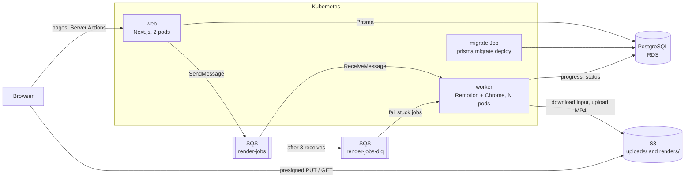
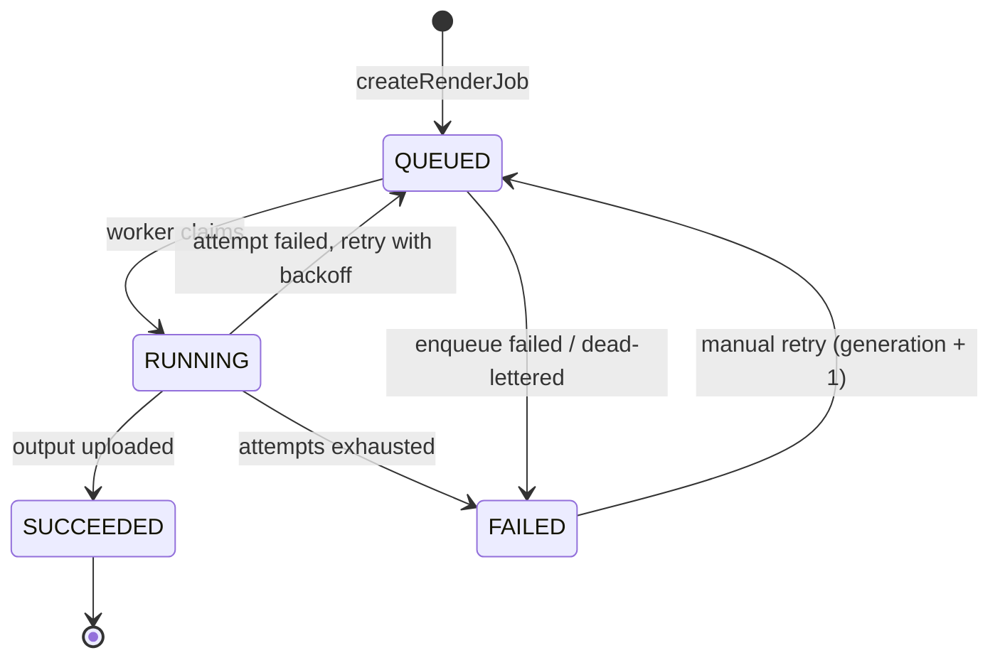

# Architecture

## Overview



Locally, MinIO stands in for S3 and ElasticMQ for SQS. The code uses the AWS
SDK in both cases and only the endpoint settings differ.

## What each piece does

| Piece | Role here |
| --- | --- |
| **Next.js App Router** | The web app. Pages are Server Components that query Postgres directly; there is no separate REST API for the UI. |
| **Server Components** | Render on the server with data already loaded. The dashboards and job history are plain `async` functions calling Prisma. |
| **Server Actions** | Mutations called from forms: create property, issue an upload URL, confirm an upload, create a render, retry a render. Each one validates input with zod and checks the workspace. |
| **Route Handlers** | Used only where the caller is not this app's UI: `/api/health`, `/api/ready` for Kubernetes probes, `/api/editor/render` for the timeline editor. |
| **Prisma** | Schema, migrations and a typed client, shared by web and worker through `packages/db`. |
| **PostgreSQL** | Source of truth for properties, media, jobs and outputs. Job status changes are conditional updates. |
| **S3** | Stores uploads and rendered MP4s. The browser uploads straight to it with a presigned URL, so large files never pass through Next.js. |
| **SQS** | Hands render jobs to workers. Gives at-least-once delivery, a visibility timeout that acts as a lease, and a dead-letter queue. |
| **Worker** | Long-polls SQS, renders with Remotion (headless Chrome + ffmpeg), uploads the MP4, updates the job. One render per pod at a time. |
| **Turborepo** | Runs `typecheck`, `test` and `build` across the workspace in dependency order with caching, and makes sure the Prisma client is generated first. |
| **Docker** | One image per deployable: `web` (Next.js standalone output) and `worker` (Node, ffmpeg, Chrome). |
| **Kubernetes** | Runs web and worker as separate Deployments with probes, resource limits and rolling updates; runs migrations as a Job. |
| **Helm** | Packages the Kubernetes manifests. `values.yaml` targets AWS, `values-kind.yaml` the local cluster. |
| **kind** | A Kubernetes cluster inside Docker, for running the chart locally. |
| **GitHub Actions** | Lint, typecheck, unit tests, Helm lint, image builds, Trivy scans, end-to-end tests. Pushes to ECR once an AWS role is configured. |
| **Trivy** | Scans the lockfile, the Dockerfiles and manifests, and the built images for known vulnerabilities and misconfiguration. |
| **Argo CD** | Optional GitOps deploy: the cluster pulls the chart from Git and keeps itself in sync (`infra/argocd`). |
| **Vitest** | Unit tests for the state machine, queue decisions, upload rules and the worker's message handler. |
| **Playwright** | End-to-end tests through a real browser against the running stack, including a real render. |

## Repository layout

```
apps/web          Next.js app (Server Components, Server Actions)
apps/worker       SQS consumer that renders jobs
apps/editor       Standalone browser timeline editor (Vite)
packages/core     Pure logic: job state machine, delivery/retry decisions, upload rules
packages/db       Prisma schema, migrations, client, seed
packages/render   Remotion compositions and render functions
e2e               Playwright tests
infra/helm        Helm chart for web, worker and the migration Job
infra/kind        Local cluster config and bootstrap script
infra/k8s/local   Postgres, MinIO and ElasticMQ for the local cluster
infra/argocd      Argo CD install script and Application
infra/terraform   Early AWS resource sketch (S3, CloudFront, SQS, RDS)
docs/adr          Architecture decision records
```

## Database schema

| Model | Purpose |
| --- | --- |
| `Workspace` | Tenant boundary. Every query is scoped to the current user's workspace. |
| `User` | Belongs to one workspace. There is no login yet: requests act as a seeded demo user, resolved in one function (`apps/web/lib/workspace.ts`). |
| `Property` | A listing: title, address, description. |
| `MediaAsset` | An uploaded photo or video. `objectKey` is the S3 key and is unique. |
| `Template` | A reel style: which Remotion composition, default caption, brand. Seeded. |
| `RenderJob` | One request to render. Holds `status`, `progress`, `attempt`, `generation`, `heartbeatAt` and the last `error`. |
| `RenderOutput` | The finished MP4. `jobId` is unique: one output per job, however many times it was rendered. |

## Render job lifecycle



The transition table is `packages/core/src/job-status.ts`. What a worker does
with each delivery is `decideDelivery` in `packages/core/src/queue.ts`:

| Job row when the message arrives | Action |
| --- | --- |
| missing, `SUCCEEDED`, `FAILED`, or a different `generation` | delete the message (duplicate or stale) |
| `QUEUED` | claim and render |
| `RUNNING`, heartbeat fresh | leave the message; another worker has it |
| `RUNNING`, heartbeat older than 60 s | claim and render; the previous worker died |

Timing, all configurable: visibility timeout 120 s, heartbeat every 20 s,
stale after 60 s, 3 attempts, backoff 15 s then 30 s.

## Upload flow

1. The browser calls the `createUploadUrl` Server Action with the file name,
   type and size. The action validates them and returns a presigned S3 PUT URL.
2. The browser PUTs the file to S3 directly, with progress.
3. The browser calls `confirmUpload`. The action checks the object exists
   with `HeadObject` and only then creates the `MediaAsset` row.

Server Actions have a small request body limit by default, and a 2 GB video
has no business in the web server's memory anyway.

## Known gaps

- No authentication. One seeded user and workspace.
- No AI features yet (Bedrock captions are planned).
- Worker autoscaling is CPU-based and off by default; KEDA on queue depth is planned.
- EKS, RDS and CloudFront are designed for but not deployed (ADR 0005).
- The enqueue is not transactional with the job insert (ADR 0001).
- `packages/render` and `apps/editor` are outside the lint and typecheck gate.
